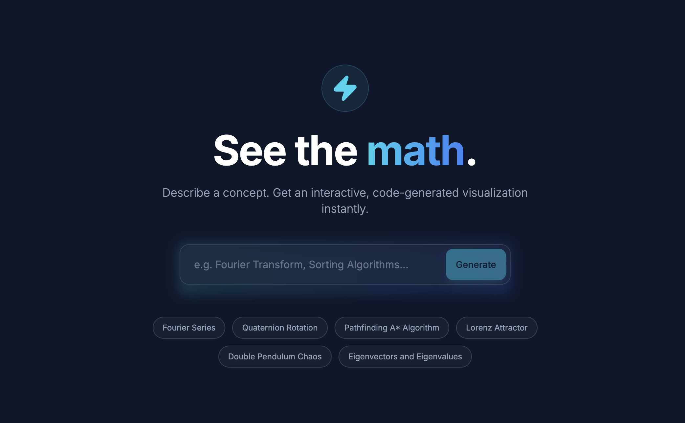

  

# Concept Viz — Gemini 3 concept visualizer

Concept Viz turns any concept into an interactive visualization. Type a topic and Gemini 3 Pro Preview generates the visualization code and short explainer, rendered in-app with a toggle to inspect the HTML/JS/CSS behind it.

Video walkthrough: [`YouTube`](https://youtu.be/zPXqZodGQ6A)

## What it does

- Generates highly interactive visuals (D3.js or Canvas) from natural language prompts, styled for a dark UI.
- Offers quick suggestions to jumpstart prompts and a fast regenerate flow.
- Dual views: play with the visualization or read the generated code; download a self-contained HTML file for reuse.
- Inline explanation panel you can show/hide while exploring the visualization.

## Run locally

**Prerequisites:** Node.js

1. Install dependencies: `npm install`
2. Add your API key: create a `.env` file in the project root with `GEMINI_API_KEY=your_key_here`
3. Start the dev server: `npm run dev`
4. Open the provided localhost URL and start visualizing concepts.

## Examples

- Binary search: [`examples/binary_search.html`](examples/binary_search.html) | live: [`https://square-zero-labs.github.io/concept-viz-gemini3/examples/binary_search`](https://square-zero-labs.github.io/concept-viz-gemini3/examples/binary_search)
- Classifier-free guidance: [`examples/classifier_free_guidance.html`](examples/classifier_free_guidance.html) | live: [`(https://square-zero-labs.github.io/concept-viz-gemini3/examples/classifier_free_guidance`](https://square-zero-labs.github.io/concept-viz-gemini3/examples/classifier_free_guidance)
- Matrix multiplication: [`examples/matrix-multiplication.html`](examples/matrix-multiplication.html) | live: [`https://square-zero-labs.github.io/concept-viz-gemini3/examples/matrix-multiplication`](https://square-zero-labs.github.io/concept-viz-gemini3/examples/matrix-multiplication)
- Monty Hall problem: [`examples/monty_hall_paradox_explorer.html`](examples/monty_hall_paradox_explorer.html) | live: [`https://square-zero-labs.github.io/concept-viz-gemini3/examples/monty_hall_paradox_explorer`](https://square-zero-labs.github.io/concept-viz-gemini3/examples/monty_hall_paradox_explorer)
- NBA salary cap: [`examples/nba_salary_cap.html`](examples/nba_salary_cap.html) | live: [`https://square-zero-labs.github.io/concept-viz-gemini3/examples/nba_salary_cap`](https://square-zero-labs.github.io/concept-viz-gemini3/examples/nba_salary_cap)
- Stacked discounts: [`examples/stacked_discounts.html`](examples/stacked_discounts.html) | live: [`https://square-zero-labs.github.io/concept-viz-gemini3/examples/stacked_discounts`](https://square-zero-labs.github.io/concept-viz-gemini3/examples/stacked_discounts)

Browse all examples on GitHub Pages: [`Examples`](https://square-zero-labs.github.io/concept-viz-gemini3/examples/index.html).
